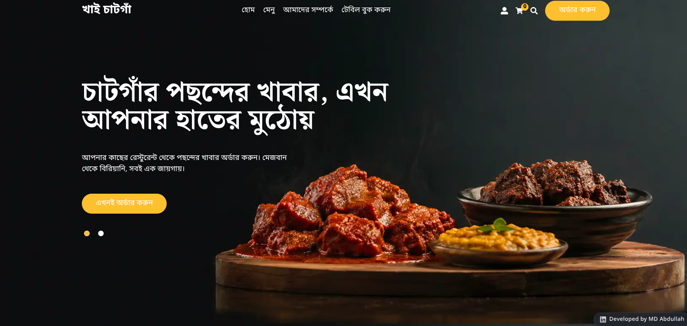
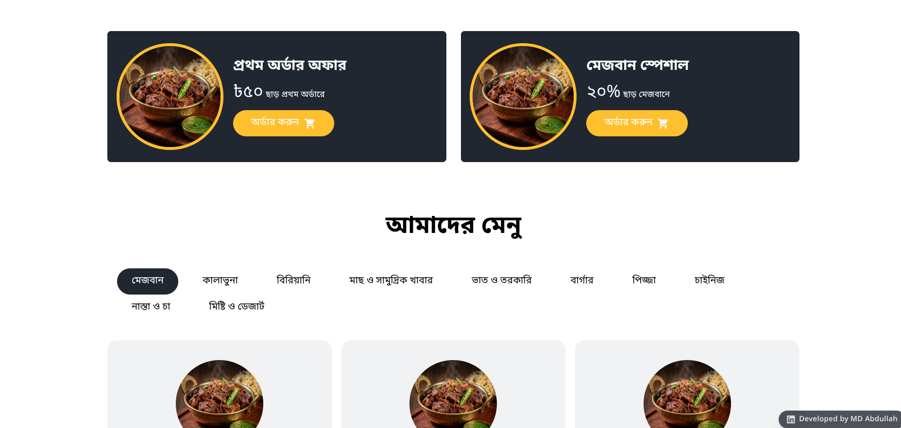
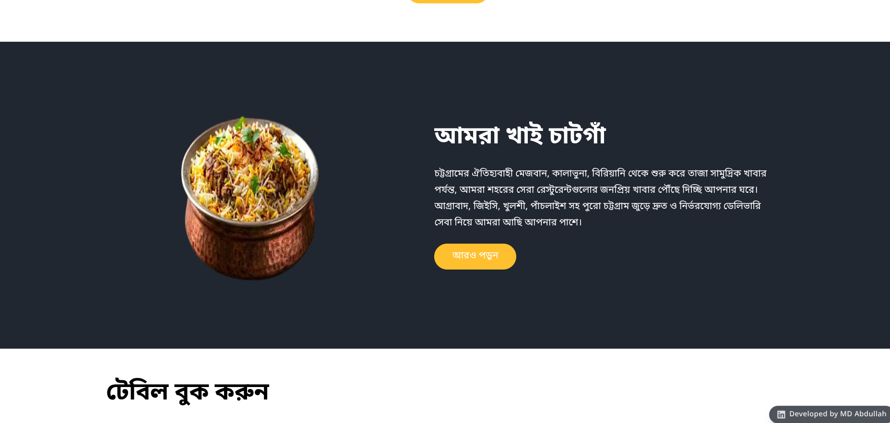
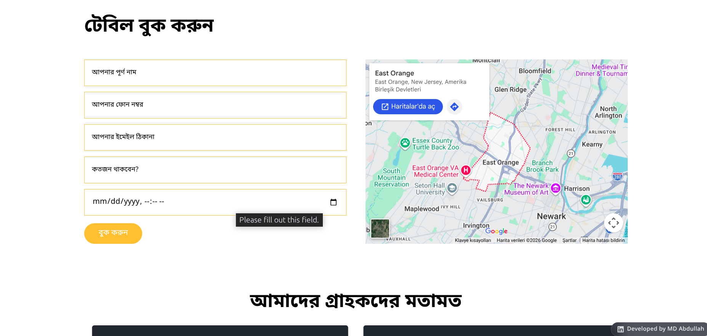

# Khai Chattogram (খাই চাটগাঁ)

A food ordering web application for Chattogram's traditional cuisine. From Mezban and Kala Bhuna to Biryani and fresh seafood, it delivers popular dishes from the city's best restaurants straight to the customer's doorstep.

Built with [Next.js](https://nextjs.org/), the project includes online ordering, table reservations, menu browsing, and user authentication.

## Tech Stack

- **Frontend:** React, Next.js, Tailwind CSS, MUI
- **State Management:** Redux Toolkit
- **Authentication:** NextAuth
- **Forms & Validation:** Formik, Yup
- **Database:** MongoDB / Mongoose

## Features

- Menu browsing by category (Mezban, Kala Bhuna, Biryani, Fish & Seafood, etc.)
- Online ordering with cart system
- Table booking / reservation form with map location
- User authentication and profiles
- Responsive design

## Getting Started

1. Clone the project: `git clone <repo-url>`
2. Install dependencies: `npm install`
3. Start the development server: `npm run dev`
4. Open in your browser: `http://localhost:3000`

## Screenshots

### Homepage

### Menu

### About

### Reservation

---

Developed by MD Abdullah
